<div align="center">


<br/>


<br/><br/>

<h3><code>lucas@github ~ $ whoami</code></h3>

<table>
  <tr>
    <td valign="top"></td>
    <td valign="top"></td>
  </tr>
</table>

<h3><code>lucas@github ~ $ ./contributions.sh</code></h3>



</div>

---

## FEATURED PROJECT

<div align="center">

<a href="https://github.com/LucasFernandesBrazil/ClipArk">

</a>

[](https://github.com/LucasFernandesBrazil/ClipArk/releases/latest)
[](https://github.com/LucasFernandesBrazil/ClipArk/stargazers)
[](https://github.com/LucasFernandesBrazil/ClipArk/blob/main/LICENSE)


</div>

```console
$ clipark --about
> ClipArk — a local-first clipboard manager for macOS.

  macOS remembers exactly one thing you copied. ClipArk keeps the rest:
  hit ⌘⇧V and everything is back — searchable, typed and categorised.

  · no account, no sync, no telemetry — literally no network code
  · one SQLite file on your own machine, and that is the whole design
  · ⏎ pastes the clip straight back into the app you came from
  · menu-bar only, keyboard-driven, MIT licensed

$ clipark --stack
> Tauri 2 · Rust · React · TypeScript · SQLite
```

<details>
<summary><b>🇧🇷 sobre o ClipArk em português</b></summary>

```console
$ clipark --sobre
> ClipArk — gerenciador de área de transferência local-first para macOS.

  O macOS lembra de exatamente uma coisa que você copiou. O ClipArk guarda
  o resto: ⌘⇧V e todo o histórico volta — buscável, tipado e categorizado.

  · sem conta, sem sync, sem telemetria — nenhum código de rede
  · um único arquivo SQLite na sua máquina, e esse é o projeto inteiro
  · ⏎ cola o item direto no app de onde você veio
  · só na barra de menu, movido a teclado, licença MIT
```

</details>

<div align="center">

[](https://github.com/LucasFernandesBrazil/ClipArk/releases/latest)
[](https://github.com/LucasFernandesBrazil/ClipArk)
[](https://github.com/LucasFernandesBrazil/ClipArk/stargazers)

</div>
